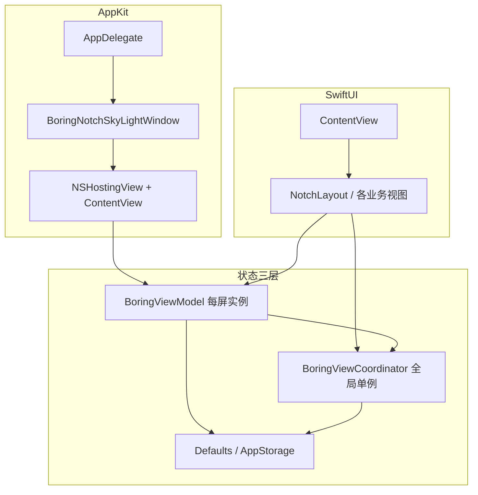

# boring.notch / Island — 技术架构说明

本文档描述 **Island**（仓库名 `boring.notch`）的 macOS 端架构：状态分层、窗口与输入、模块边界，以及扩展功能时的推荐路径。面向需要改代码或做 Code Review 的贡献者。

与实现细节相关的模块约定（动画、小组件、音乐、Liquid Glass 等）见 **`.cursor/skills/island-best-practice/references/`**；**以仓库源码为准**，本文随主分支更新。

**目录**：[1](#1-项目定位与运行时约束) · [2](#2-架构总览) · [3](#3-三层状态管理) · [4](#4-应用入口与窗口模型) · [5](#5-视图组合逻辑结构) · [6](#6-managers单例服务) · [7](#7-observers-与其它横切能力) · [8](#8-扩展新功能时的推荐顺序) · [9](#9-尺寸与布局常量) · [10](#10-ui-与设计约定liquid-glass) · [11](#11-手势与动画) · [12](#12-全局快捷键与语音) · [13](#13-相关文档)

---

## 1. 项目定位与运行时约束

- **形态**：菜单栏常驻、屏幕顶部居中的 **无边框浮动面板**（非传统 document window），用 SwiftUI 绘制「刘海 / Dynamic Island」交互区。
- **系统**：macOS 14+；主要面向带刘海的 MacBook；支持多显示器、锁屏显示、全屏时隐藏等策略。
- **技术栈**：Swift 5 + **SwiftUI**（UI）+ **AppKit**（`NSWindow` / `NSPanel`、`NSHostingView`）、**Combine**、**Defaults**（持久化偏好）、**Sparkle**（更新）、**KeyboardShortcuts** 等。

---

## 2. 架构总览



- **视图层**：`ContentView` 为根；内部 `NotchLayout` 按 `notchState`（开/合）与 `coordinator.currentView` 路由到 Home、Shelf、Settings、Widgets 等。
- **状态层**：见下一节「三层状态」。
- **系统层**：`AppDelegate` 创建/定位窗口、多屏生命周期、拖拽检测、锁屏与 SkyLight 等；与 `NotchSpaceManager`、私有 API 封装等配合。

---

## 3. 三层状态管理

### 3.1 `BoringViewModel`（每块屏幕一份）

- **职责**：**单屏**刘海的 UI 状态：开合 `notchState`、`notchSize`、拖放高亮、摄像头展开、与 `FullscreenMediaDetector` 联动的「全屏时隐藏」等。
- **传递**：通过 `.environmentObject(viewModel)` 注入子树。
- **多显示器**：`AppDelegate` 可为每块屏维护 `windows[UUID]` 与 `viewModels[UUID]`；`screenUUID` 用于区分屏与尺寸计算。

### 3.2 `BoringViewCoordinator`（全局单例）

- **职责**：跨屏共享的「岛」级状态，主要包括：
  - **导航**：`currentView: NotchViews`（与 `ContentView.NotchLayout` 内 `switch` 一致）。
  - **瞬时 HUD**：`sneakPeek`（音量/亮度/背光/麦克风/音乐/通知等短时条）、`expandingView`（如电池、pomodoro、蓝牙、下载等带自动隐藏的扩展条）。
  - **屏幕**：`preferredScreenUUID` / `selectedScreenUUID`；历史上从「按显示器名称存储」迁移为 **UUID**（`private init()` 内迁移逻辑）。
  - **其它**：`notchIsOpen`、`helloAnimationRunning`（首次启动动画）、`firstLaunch` / `showWhatsNew`（`@AppStorage`）、标签栏相关 `alwaysShowTabs`、`openLastTabByDefault` 等。
- **访问**：`BoringViewCoordinator.shared`；在需要路由或全局 HUD 的视图中 `@ObservedObject`。
- **与 ViewModel**：`BoringViewModel` 内部持有 `coordinator` 引用，用于与全局状态同步（如部分场景下的联动）。

### 3.3 `Defaults` + `@AppStorage`

- **Defaults**（sindresorhus/Defaults）：键集中在 `Constants.swift` 的 `extension Defaults.Keys`；视图用 `@Default(.key)` 绑定。
- **@AppStorage**：部分历史或简单布尔项仍直接存 UserDefaults（与 Coordinator 中的迁移逻辑并存）。

**原则**：用户可配置项优先走 Defaults；与「当前导航 / 临时 HUD」相关的走 Coordinator；与「单屏几何与交互」相关的走 ViewModel。

---

## 4. 应用入口与窗口模型

### 4.1 SwiftUI `App` 与菜单栏

- `DynamicNotchApp`：提供 **MenuBarExtra**（星标菜单）、Sparkle 更新入口、打开独立 **Settings** 窗口等。
- 刘海主 UI **不**走 `WindowGroup` 默认文档窗口，而是由 `AppDelegate` 手动创建。

### 4.2 `AppDelegate` 核心职责

- 按配置创建 **一个或多个** `BoringNotchSkyLightWindow`（继承/封装自 `NSWindow`，带 SkyLight 锁屏相关能力）。
- `contentView` 使用 `NSHostingView(rootView: ContentView().environmentObject(viewModel))`。
- 处理：屏幕增删、窗口居中贴顶、`showOnAllDisplays`、锁屏/解锁、`DragDetector` 与拖入刘海区域自动打开 Shelf 等。

### 4.3 输入与快捷键

- 全局快捷键（如 **KeyboardShortcuts**）、Fn 长按语音（与 **SpeechManager**、拦截器配合）、媒体键等分布在 `observers/`、`managers/` 与 AppDelegate 启动逻辑中。
- 需要键盘焦点、面板可成为 key window 等行为见 skill 内 **`window-and-input.md`**。

---

## 5. 视图组合（逻辑结构）

```
ContentView
└── ZStack / VStack 等
    └── NotchLayout
        ├── [closed] 语音指示、通知、扩展条、Sneak Peek、音乐 Live Activity、人脸动画、ClosedNotchWidgetBar 等（按优先级分支）
        ├── [open]   BoringHeader（标签 / 操作）
        └── [open]   switch coordinator.currentView → 下方主内容区
```

**`NotchViews` → 主视图映射**（`ContentView.swift` 内 `switch coordinator.currentView`，仅在 `vm.notchState == .open` 时展示主内容区）：

| `NotchViews` | 视图 |
|--------------|------|
| `.home` | `NotchHomeView` |
| `.shelf` | `ShelfView` |
| `.clip` | `DynaClipView`（剪贴/片段类能力） |
| `.settings` | `NotchSettingsView` |
| `.translation` | `TranslationView` |
| `.market` | `MarketTickerView` |
| `.widgets` | `WidgetHubView` |
| `.todoList` | `TodoListView` |
| `.inspiration` | `InspirationView` |

- 枚举定义见 **`enums/generic.swift`**。新增顶层页需同时：扩展 `NotchViews`、在 **`ContentView.NotchLayout`** 的 `switch` 中接入、按需调整 **`vm.notchSize`**、在 Tab / 设置中暴露入口（参见 skill 中的 **Checklist for New Features**）。

**Home 页说明**：`NotchHomeView` 当前 **`body` 仅包含 `primaryRow`**（音乐 + 可选日历/摄像头）。代码里已有 **`secondaryWidgetRow`**（行情 / 番茄等紧凑小组件），但尚未挂入视图树；若未来接入，需同步评估 **`openNotchSize`** 高度与 **`references/widget-system.md`** 中的布局约定。

---

## 6. Managers（单例服务）

`managers/` 下多为 **`@MainActor` + `ObservableObject` + `static let shared`**，封装系统能力或长生命周期任务，例如：

| 方向 | 代表 |
|------|------|
| 媒体 | `MusicManager` |
| 语音 | `SpeechManager` |
| 日历/天气 | `CalendarManager`、`WeatherManager` |
| 系统 HUD | `VolumeManager`、`BrightnessManager`、`BatteryActivityManager` |
| 业务功能 | `TranslationManager`、`MarketManager`、`PomodoroManager`、`WebcamManager` |
| 列表/剪贴 | `TodoListManager`、`InspirationManager`、`DynaClipManager` |
| 通知 / 蓝牙 | `UserNotificationManager`、`BluetoothManager`（闭合态扩展条等） |
| Shelf 状态 | `ShelfStateViewModel`（与拖放、`ShelfView` 联动） |
| 空间/窗口 | `NotchSpaceManager` |
| 其它 | `ImageService` 等按需查阅 `managers/` 目录 |

新增能力时优先 **复用现有单例模式**，避免在视图里直接堆 API 调用。

---

## 7. Observers 与其它横切能力

- **`observers/`**：全屏检测、媒体键、拖拽等系统事件。
- **`sizing/`**：刘海宽高、圆角等常量计算（与屏 UUID 绑定）。
- **`metal/`**：音频可视化等着色器相关。
- **`private/`**：与窗口空间/私有 API 相关的桥接（随 Xcode 工程维护）。

---

## 8. 扩展新功能时的推荐顺序

1. 若需持久化开关：在 `Constants.swift` 增加 `Defaults.Keys`。
2. 若需后台逻辑：在 `managers/` 增加单例（或扩展现有 Manager）。
3. 若需新「整页」：扩展 `NotchViews` + `ContentView` 路由 + 必要时调整 `notchSize`。
4. 新 Swift 文件加入 **`boringNotch.xcodeproj/project.pbxproj`**（详见 skill **`xcode-integration.md`**）。
5. 在 **刘海内设置**（`NotchSettingsView`）和/或 **独立 Settings 窗口**（`SettingsView` / `SettingsWindowController`）中暴露开关。
6. 同时验证：**Liquid Glass 开/关**、**刘海开/合**、多显示器（若相关）。
7. **全高滚动页**（如设置、翻译、行情、小组件中心、剪贴、Todo、灵感）：除调整 `notchSize` 外，还需在 **`ContentView.handleUpGesture`** 的 `scrollLocked` 集合中加入对应 `NotchViews`，并在 **`onChange(of: coordinator.currentView)`** 的 `needsTall` 判断中保持一致，否则上滑手势会误关刘海。

更细的动画、小组件布局、音乐模块规则等见 **`.cursor/skills/island-best-practice/references/`** 下各篇（`animation-patterns.md`、`widget-system.md`、`music-module.md` 等）。

---

## 9. 尺寸与布局常量

刘海与窗口的 **单一事实来源** 在 **`boringNotch/sizing/matters.swift`**（及同目录下与屏 UUID 相关的计算函数）：

| 符号 | 典型用途 |
|------|----------|
| `openNotchSize` | 默认展开高度（当前 **660 × 200**） |
| `settingsNotchSize` | 设置/翻译/行情等「加高」页（**660 × 380**） |
| `windowSize` | `AppDelegate` 创建窗口时的逻辑尺寸（含 `shadowPadding`） |
| `cornerRadiusInsets` | 开/合状态下顶、底圆角 |
| `MusicPlayerImageSizes` | 专辑图圆角与开/合尺寸 |
| `UIConstants.widgetSingleRowMaxWidth` | Home 第二行小组件单行居中时的最大宽度 |

**闭合态横向宽度**：`ContentView` 中 **`computedChinWidth`** 根据语音条、通知、扩展条、音乐 Live Activity、人脸动画、`ClosedNotchWidgetBar` 等状态动态计算，并 **`min(..., windowSize.width - 20)`** 防止小屏溢出。改闭合态 UI 时需同步检查该逻辑。

---

## 10. UI 与设计约定（Liquid Glass）

应用根视图使用 **`.preferredColorScheme(.dark)`**；不要在业务视图里单独做浅色主题。

- **Liquid Glass 开启且刘海展开**：`ContentView` 中黑色底渐隐，**`.ultraThinMaterial`** 渐显；`BoringHeader` 刘海挖孔区域在 glass 下为 **`.clear`**。详见 skill 内 **`design-conventions.md`**。
- **半透明表面上的文字/图标**：优先使用 **`extensions/VisualEffectBlur.swift`** 中的 **`.glassText()` / `.glassSecondaryText()` / `.glassIcon()`**（或 **`.adaptiveText(isGlass:)`**），保证对比度与阴影；glass 上避免大块 **`Color.black`** 填充（易与设计规范冲突）。
- **通用控件**：`HoverButton`、胶囊按钮等与深色/玻璃背景搭配时，图标色宜用 **`.white` / `.gray`** 等明确色，避免依赖 **`.primary`** 在材质上的可读性。

---

## 11. 手势与动画

- **交互弹簧**（移动、悬停、拖动手势反馈）：`Animation.interactiveSpring(response: 0.38, dampingFraction: 0.8, blendDuration: 0)`（与 `ContentView` 中 `animationSpring` 一致）。
- **展开 / 收起刘海**：展开约 `response: 0.42, dampingFraction: 0.8`；收起约 `response: 0.45, dampingFraction: 1.0`。
- **切换 `currentView`**：常用 `.spring(response: 0.35, dampingFraction: 0.8)`。
- **`matchedGeometryEffect` ID**：如 `"albumArt"`、`"spectrum"`、`"capsule"`（Tab 指示）等，勿随意改名以免破坏过渡。

完整弹簧表与 transition 示例见 **`animation-patterns.md`**。

---

## 12. 全局快捷键与语音

- **快捷键定义**：`boringNotch/Shortcuts/ShortcutConstants.swift`（KeyboardShortcuts）及 README 中的说明；部分可在设置中重映射。
- **语音听写（按住 Fn）**：**`SpeechManager`** 驱动状态机；闭合刘海上的 UI 为 **`SpeechRecordingIndicator`**；与 Fn 相关的系统级监听在 **`observers/`**（如 `FunctionKeyInterceptor` / `MediaKeyInterceptor` 等，以仓库为准）及 `AppDelegate` 生命周期中启停。
- **语音活跃时阻断刘海交互**：`SpeechManager.blocksNotchInteractions` 等标志在 **`ContentView`** 的悬停、点击、拖放手势与拖放自动展开逻辑中被检查。

---

## 13. 相关文档

| 文档 | 说明 |
|------|------|
| [README.md](./README.md) | 产品功能、安装与使用；内含架构导读与本文链接 |
| [CONTRIBUTING.md](./CONTRIBUTING.md) | 贡献流程 |
| [SECURITY.md](./SECURITY.md) | 安全披露 |
| `.cursor/skills/island-best-practice/SKILL.md` | 目录结构、状态分层、新功能 Checklist |
| `.cursor/skills/island-best-practice/references/*.md` | 设计、动画、音乐、小组件、窗口与输入、Xcode 工程 |

---

*文档随主分支更新；尺寸常量以 `sizing/matters.swift` 为准，行为以源码为准。*
