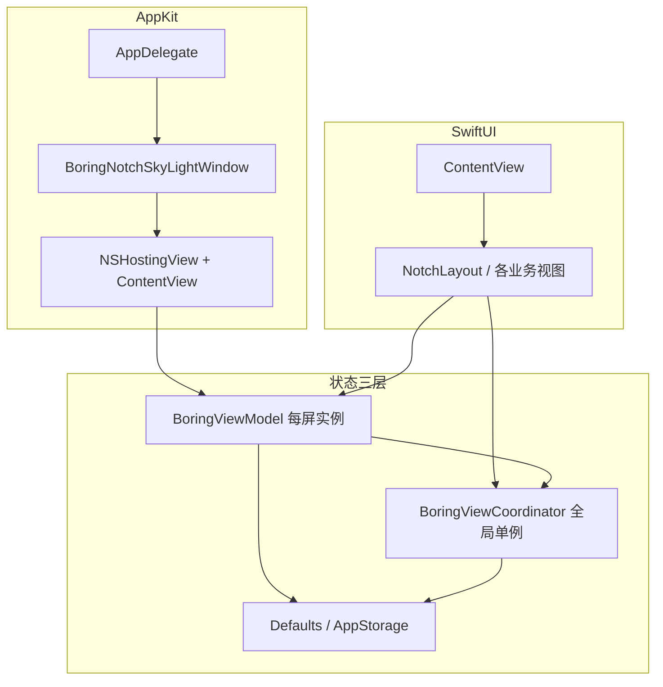

# boring.notch / Island — 技术架构说明

本文档描述 **Island**（仓库名 `boring.notch`）的 macOS 端架构：状态分层、窗口与输入、模块边界，以及扩展功能时的推荐路径。面向需要改代码或做 Code Review 的贡献者。

---

## 1. 项目定位与运行时约束

- **形态**：菜单栏常驻、屏幕顶部居中的 **无边框浮动面板**（非传统 document window），用 SwiftUI 绘制「刘海 / Dynamic Island」交互区。
- **系统**：macOS 14+；主要面向带刘海的 MacBook；支持多显示器、锁屏显示、全屏时隐藏等策略。
- **技术栈**：Swift 5 + **SwiftUI**（UI）+ **AppKit**（`NSWindow` / `NSPanel`、`NSHostingView`）、**Combine**、**Defaults**（持久化偏好）、**Sparkle**（更新）、**KeyboardShortcuts** 等。

---

## 2. 架构总览



- **视图层**：`ContentView` 为根；内部 `NotchLayout` 按 `notchState`（开/合）与 `coordinator.currentView` 路由到 Home、Shelf、Settings、Widgets 等。
- **状态层**：见下一节「三层状态」。
- **系统层**：`AppDelegate` 创建/定位窗口、多屏生命周期、拖拽检测、锁屏与 SkyLight 等；与 `NotchSpaceManager`、私有 API 封装等配合。

---

## 3. 三层状态管理

### 3.1 `BoringViewModel`（每块屏幕一份）

- **职责**：**单屏**刘海的 UI 状态：开合 `notchState`、`notchSize`、拖放高亮、摄像头展开、与 `FullscreenMediaDetector` 联动的「全屏时隐藏」等。
- **传递**：通过 `.environmentObject(viewModel)` 注入子树。
- **多显示器**：`AppDelegate` 可为每块屏维护 `windows[UUID]` 与 `viewModels[UUID]`；`screenUUID` 用于区分屏与尺寸计算。

### 3.2 `BoringViewCoordinator`（全局单例）

- **职责**：跨屏共享的「岛」级状态：当前主视图 `currentView: NotchViews`、岛是否视为打开 `notchIsOpen`、Sneak Peek / 扩展 HUD、首选屏幕 UUID、首次启动与 What’s New 等。
- **访问**：`BoringViewCoordinator.shared`；在需要路由或全局 HUD 的视图中 `@ObservedObject`。

### 3.3 `Defaults` + `@AppStorage`

- **Defaults**（sindresorhus/Defaults）：键集中在 `Constants.swift` 的 `extension Defaults.Keys`；视图用 `@Default(.key)` 绑定。
- **@AppStorage**：部分历史或简单布尔项仍直接存 UserDefaults（与 Coordinator 中的迁移逻辑并存）。

**原则**：用户可配置项优先走 Defaults；与「当前导航 / 临时 HUD」相关的走 Coordinator；与「单屏几何与交互」相关的走 ViewModel。

---

## 4. 应用入口与窗口模型

### 4.1 SwiftUI `App` 与菜单栏

- `DynamicNotchApp`：提供 **MenuBarExtra**（星标菜单）、Sparkle 更新入口、打开独立 **Settings** 窗口等。
- 刘海主 UI **不**走 `WindowGroup` 默认文档窗口，而是由 `AppDelegate` 手动创建。

### 4.2 `AppDelegate` 核心职责

- 按配置创建 **一个或多个** `BoringNotchSkyLightWindow`（继承/封装自 `NSWindow`，带 SkyLight 锁屏相关能力）。
- `contentView` 使用 `NSHostingView(rootView: ContentView().environmentObject(viewModel))`。
- 处理：屏幕增删、窗口居中贴顶、`showOnAllDisplays`、锁屏/解锁、`DragDetector` 与拖入刘海区域自动打开 Shelf 等。

### 4.3 输入与快捷键

- 全局快捷键（如 **KeyboardShortcuts**）、Fn 长按语音（与 **SpeechManager**、拦截器配合）、媒体键等分布在 `observers/`、`managers/` 与 AppDelegate 启动逻辑中。
- 需要键盘焦点、面板可成为 key window 等行为见 skill 内 **`window-and-input.md`**。

---

## 5. 视图组合（逻辑结构）

```
ContentView
└── ZStack / VStack 等
    └── NotchLayout
        ├── [closed] 音乐 Live Activity、电池、系统 HUD、通知、人脸等
        ├── [open]   BoringHeader（标签 / 操作）
        ├── [closed] ClosedNotchWidgetBar（小组件指示）
        └── [open]   switch coordinator.currentView
                     → NotchHomeView / ShelfView / NotchSettingsView / …
```

- **`NotchViews`**（`enums/generic.swift`）：`home`、`shelf`、`clip`、`settings`、`translation`、`market`、`widgets`、`todoList`、`inspiration` 等，新增顶层页需同步扩展此处与 `ContentView` 的 `switch`。

---

## 6. Managers（单例服务）

`managers/` 下多为 **`@MainActor` + `ObservableObject` + `static let shared`**，封装系统能力或长生命周期任务，例如：

| 方向 | 代表 |
|------|------|
| 媒体 | `MusicManager` |
| 语音 | `SpeechManager` |
| 日历/天气 | `CalendarManager`、`WeatherManager` |
| 系统 HUD | `VolumeManager`、`BrightnessManager`、`BatteryActivityManager` |
| 业务功能 | `TranslationManager`、`MarketManager`、`PomodoroManager`、`WebcamManager` |
| 列表/剪贴 | `TodoListManager`、`InspirationManager`、`DynaClipManager` |
| 空间/窗口 | `NotchSpaceManager` |

新增能力时优先 **复用现有单例模式**，避免在视图里直接堆 API 调用。

---

## 7. Observers 与其它横切能力

- **`observers/`**：全屏检测、媒体键、拖拽等系统事件。
- **`sizing/`**：刘海宽高、圆角等常量计算（与屏 UUID 绑定）。
- **`metal/`**：音频可视化等着色器相关。
- **`private/`**：与窗口空间/私有 API 相关的桥接（随 Xcode 工程维护）。

---

## 8. 扩展新功能时的推荐顺序

1. 若需持久化开关：在 `Constants.swift` 增加 `Defaults.Keys`。
2. 若需后台逻辑：在 `managers/` 增加单例（或扩展现有 Manager）。
3. 若需新「整页」：扩展 `NotchViews` + `ContentView` 路由 + 必要时调整 `notchSize`。
4. 新 Swift 文件加入 **`boringNotch.xcodeproj/project.pbxproj`**（详见 skill **`xcode-integration.md`**）。
5. 在 ** notch 内设置** 和/或 **独立 Settings 窗口** 中暴露开关。
6. 同时验证：**Liquid Glass 开/关**、**刘海开/合**、多显示器（若相关）。

更细的动画、小组件布局、音乐模块规则等见 **`.cursor/skills/island-best-practice/references/`** 下各篇（`animation-patterns.md`、`widget-system.md`、`music-module.md` 等）。

---

## 9. 相关文档

| 文档 | 说明 |
|------|------|
| [README.md](./README.md) | 产品功能、安装与使用 |
| [CONTRIBUTING.md](./CONTRIBUTING.md) | 贡献流程 |
| [SECURITY.md](./SECURITY.md) | 安全披露 |
| `.cursor/skills/island-best-practice/` | 模块级约定与 references |

---

*文档版本随主分支演进；若与代码不一致，以仓库源码为准。*
